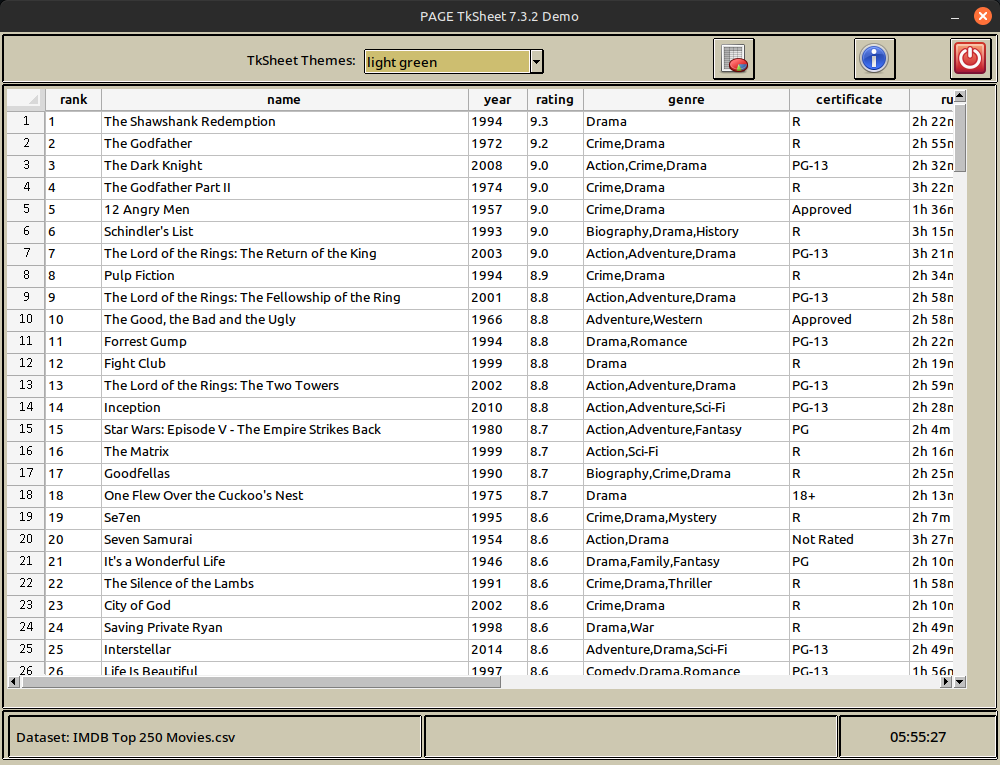

tkSheet7 - Using TkSheet within a PAGE project
================================================

Written by Greg Walters
---------------------------

Copyright © 2020,2025 by DesignagedGeek Software

This program is licensed under the MIT licence (see license.txt)




*  Purpose

I originally created a small demonstration program showing how to use the TkSheet Third party table widget within a PAGE program back in 2020.  
  
Now, since both PAGE and TkSheet have matured, I decided to create an updated version.  
  
Unfortunately, due to time constraints and some issues with PAGE, I had to "hack" the GUI.py file (something I warn **EVERYONE** not to do, EVER.  Once you reopen the PAGE project to make any changes, the new GUI.py file will overwrite your changes. I realize this is a bad thing to admit to doing, but time, as they say, is a cruel mistress! That is why there is no .tcl file for this project.  Eventually, I will update the project and I will include all three files.  
  
Not to worry, though. The TkSheet widget gets inserted into the main frame (the one in the middle) and this happens in code. So the actual GUI doesn't have much to do with anything.

You can find the TkSheet documentation at <https://github.com/ragardner/tksheet/wiki/Version-7>

This program was tested using:

Python 3.11.4

TkSheets 7.3.2

Pandas 2.1 4


  * Coding

When using TkSheet within a PAGE project, it is fairly simple to do.  Here, I will outline the steps to create an instance of the TkSheet object, set it up and place (insert) it into the FrameMain in the Toplevel form.

```python
    # ====================================================================

    #    Initialize the TkSheet Widget

    # ====================================================================

    global sheet
```   
Here we create a global variable named sheet.  This will be the instance of the TkSheet object.

```python

    # ====================================================================

    #    Set Alternate Row Colours on the sheet

    # ====================================================================


    global tkSheetTheme
    tkSheetTheme = "light green"
    sheet = Sheet(
        _w1.FrameMain,
        theme="light green",
        font=("Ubuntu", 10, "normal"),
        header_font=("Ubuntu", 10, "bold"),
        # Use these two lines to set alternating line colours in the TkSheet
        # table_bg="khaki2",
        # alternate_color="khaki3",
    )
```
   This block of code then creates and initialize another global variable named 'tkSheetTheme'.  It is used for maintaining the selected TkSheet Theme name in the dropdown (Combobox) entry window.  
  
Next we assign the global variable sheet to the returned object of the initialized TkSheet table.  We provide the parent name (_w1.FrameMain), the theme to start off with, the font to use for the table and the font to use for the header.  

If you wish to set colours for alternating rows, you can do that in the last two lines which are commented out.  PLEASE NOTE, When using TkSheet Themes, some of the colours don't really work well.
    

```python

    # ====================================================================

    #    Enable bindings

    # ====================================================================

    sheet.enable_bindings("all", "edit_index", "edit_header")

```
Here we enable the bindings per the suggestions in the TkSheet documentation.  

```python

    # ====================================================================

    #    Load the .csv file into the sheet

    # ====================================================================

    insert_data(os.path.join(location, "Datasets", "IMDB Top 250 Movies.csv"))

```
The above line of code will insert the data from the .csv dataset into the TkSheet table as the default for the program.

```python

    # ====================================================================

    #    Finally, place the sheet into the main frame

    # ====================================================================

    sheet.place(x=3, y=3, width=960, height=600)

    # ====================================================================
```
Last, but not least, we need to insert the TkSheet object into the parent frame. I chose to use **place**, since that's what PAGE uses and it's much easier to use than the other Tcl/Tk geometry managers.  
  
Feel free to look at the code in the file tksheet7_support.py. I've tried to document the code for your ease of learning.


  * Using

Whey you start the demo, it automatically creates the TkSheet with a dataset named 'IMDB Top 250 Movies.csv' which is located in the Datasets folder.

At the top right of the demo main form, there are three buttons. From left to right they are:
   Load from spreadsheet
   About
   Exit
   
Clicking on the left button (Load from spreadsheet will bring up the Tkinter askopenfilename dialog box. To select a different .csv dataset, double click on the Datasets folder then click on the dataset you would like to load and select 'Open' or simply double click on the name of the dataset.

If the dataset is large, it will take time to load it, so the cursor will change to a watch cursor until the loading is complete.

Clicking on the About button (the one with a big "I" in the graphic) will show the About form.  Click on the "Dismiss" button in the About form to make it go away.


  * Dependencies

Currently, the only dependencies are those required by TkSheets. 

 **Python 3.8 or greater**
 
 **TkSheet**
 
 **Pandas**
 
 You should be able to get everything installed by running the included requirements.txt file like this...

pip3 install -r requirements.txt

Or you could simply use:

pip3 install tksheet --upgrade

pip3 install pandas --upgrade

if you have an earlier version already installed.

*Please note - If you need install Pandas on your system, it could take a little while, since Pandas has a number of dependencies of it's own*

